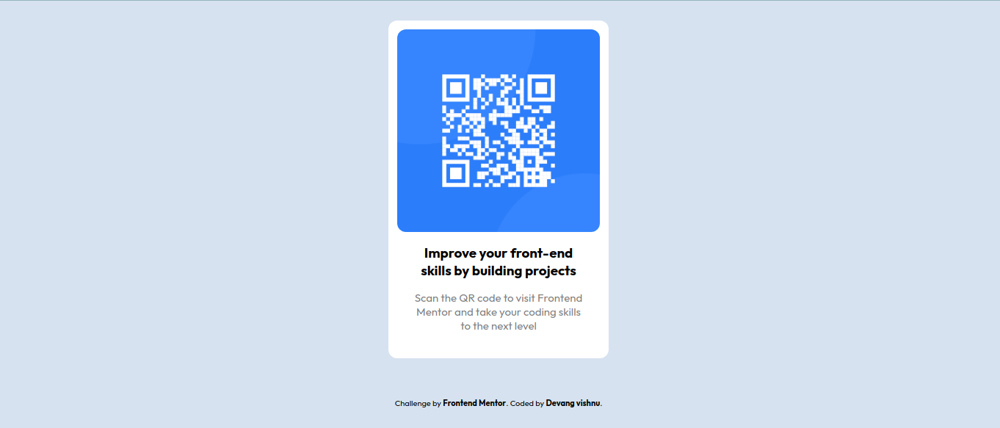

# Frontend Mentor - QR code component

This is a solution to the [QR code component challenge on Frontend Mentor](https://www.frontendmentor.io/challenges/qr-code-component-iux_sIO_H).

## Table of Contents

- [Overview](#overview)
  - [Screenshot](#screenshot)
  - [Links](#links)
- [My process](#my-process)
  - [Tools used](#tools-used)
  - [Lessons learned](#lessons-learned)
- [Author](#author)

## Overview

This is my first practice project from Frontend Mentor.

### Screenshot

Down below I've added the screenshot of my project final results. The first one is for the desktop view and the second one is for the mobile view.

Desktop View -

Mobile view -

## My process

### Tools used

Following are the tools/languages that were used to build this project.

- Semantic HTML5
- CSS3
- Custom css variables
- Media queries for responsiveness
- Flexbox for layout

### Lessons learned

This was a fairly easy project. Some of the main concepts that I got to solidify in this project were flexbox, using css variables and using basic media-queries for responsiveness.

## Author

- My GitHub - [Devang Vishnu](https://github.com/thedevangvishnu)
- Frontend Mentor - [@thedevangvishnu](https://www.frontendmentor.io/profile/thedevangvishnu)
