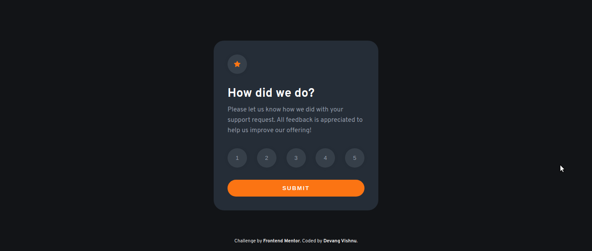
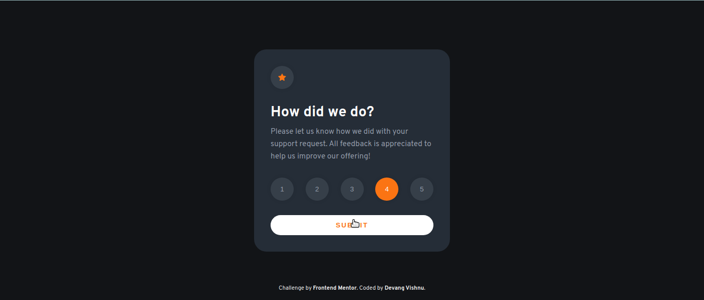
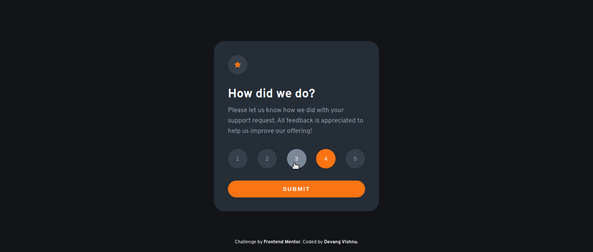
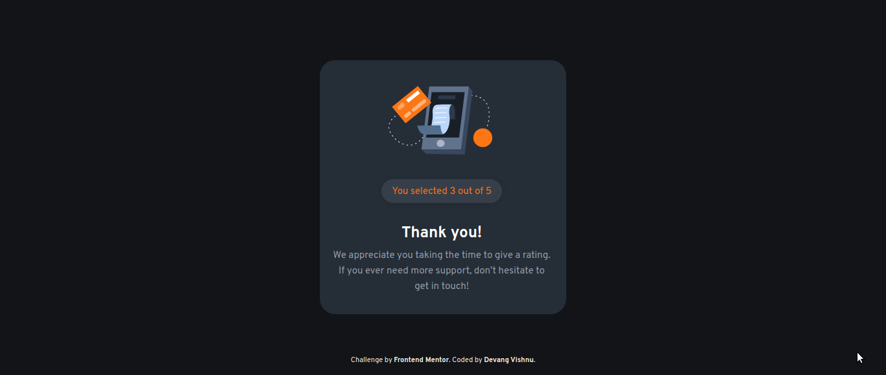
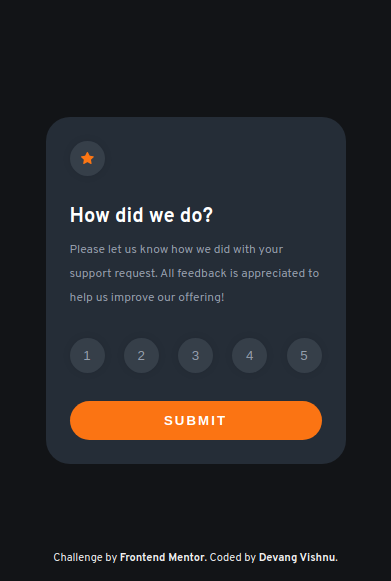
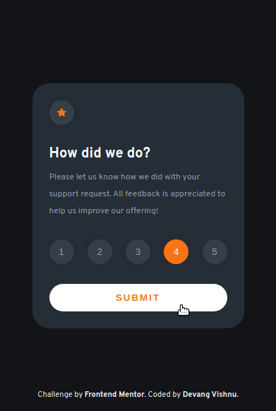

# Project-02 - Frontend Mentor - Interactive rating component

## Table of Contents

- [Overview](#overview)
  - [Screenshot](#screenshot)
  - [Links](#links)
- [My process](#my-process)
  - [Tools used](#tools-used)
  - [Challenges faced](#challenges-faced)
  - [Lessons learned](#lessons-learned)
- [Author](#author)

## Overview

This is my second practice project from Frontend Mentor.

### Screenshot

Down below I've added the screenshot of my project final results. The first one is for the desktop view and the second one is for the mobile view.

Desktop View - Contains screenshots for normal view, active view and thankyou state.

Mobile view - Contains screenshots for normal view, active view and thankyou state.

## My process

### Tools used

Following are the tools/languages that were used to build this project.

- Semantic HTML5
- CSS3
- Custom css variables
- Media queries for responsiveness
- Flexbox for layout
- JS
- DOM manipulation

### Challenges faced

I faced couple of challenges while creating this project.

- Related to z-index of both the states
  I created the second state and positioned it absolutely and turned off its opacity to hide it behind the first state. Due to this, both of my states had the same position and same z-index and the hover effects applied to the buttons of the first state were not working. It worked when I changed the z-index of both the states.

- Related to chaining classed together
  I created a bunch of classes that I wanted to use in DOM. These classes were meant to be chained with other classes to modify their styling. In stead of chaining, I was using those classes in descendent combinators manner and hence they wouldn't give me the desired results. It was only when I chained those new classes with the old ones and then when added using JS, they worked supposedly.

### Lessons learned

This was a good project. It demanded decent DOM manipulation which led me to practice my JS knowledge. Also, it required decent logical thinking to craft both the states.

It took decent amount of CSS to style, though felt fairly easy. But learned some good lessons related to z-index and chaining classes.

## Author

- My GitHub - [Devang Vishnu](https://github.com/thedevangvishnu)
- Frontend Mentor - [@thedevangvishnu](https://www.frontendmentor.io/profile/thedevangvishnu)
