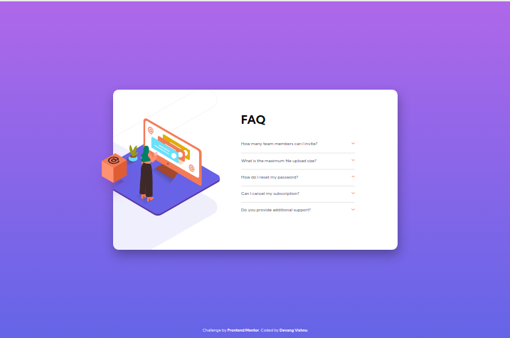
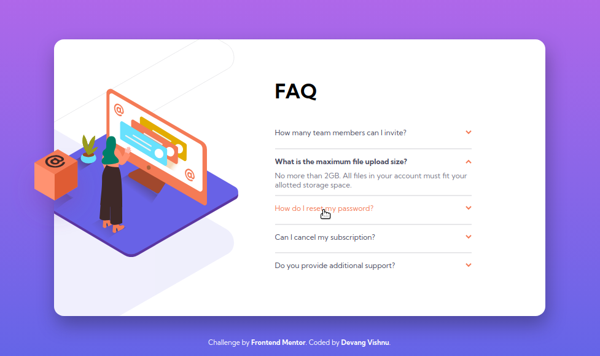
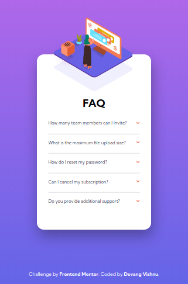

# Project-03 (P03) - FAQ accordion card

## Table of Contents

- [Overview](#overview)
  - [Screenshot](#screenshot)
  - [Links](#links)
- [My process](#my-process)
  - [Tools used](#tools-used)
  - [Challenges faced](#challenges-faced)
  - [Lessons learned](#lessons-learned)
- [Author](#author)

## Overview

This is my third practice project from Frontend Mentor in this series.

### Screenshot

Down below I've added the screenshot of my project final results. The first one is for the desktop view and the second one is for the mobile view.

Desktop View - Contains screenshots for normal view and active view.

Mobile view - Contains screenshots for normal view. Active state is similar to the desktop view but only in this orientation and styling.

## My process

### Tools used

Following are the tools/languages that were used to build this project.

- Semantic HTML5
- CSS3
- Custom css variables
- Media queries for responsiveness
- Flexbox for layout
- JS
- DOM manipulation

### Challenges faced

I faced one major challenge while creating this project.

- Related to positioning of container and the image in relation to it:
  In this project, the image positioning really got me irritated. Firstly, I couldn't understand how to group them, because the image of the woman in inside the container but the box is outside. Also, I had to do countless trial and error to correctly get the positioning right as is soon is the final result. The main trick was to use calc() in while positioning them which positions them in accordance to the
  screen size.

### Lessons learned

This was a good project. It demanded decent DOM manipulation which led me to practice my JS knowledge. I got some really good practice in learning to position elements that were not so easy.

It took decent amount of CSS to style, though felt fairly easy. But learned some good lessons related to z-index and positioning elements to top of one another.

## Author

- My GitHub - [Devang Vishnu](https://github.com/thedevangvishnu)
- Frontend Mentor - [@thedevangvishnu](https://www.frontendmentor.io/profile/thedevangvishnu)
