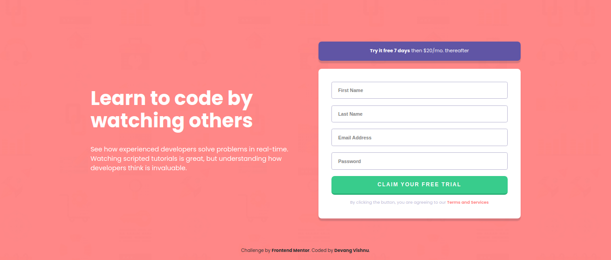
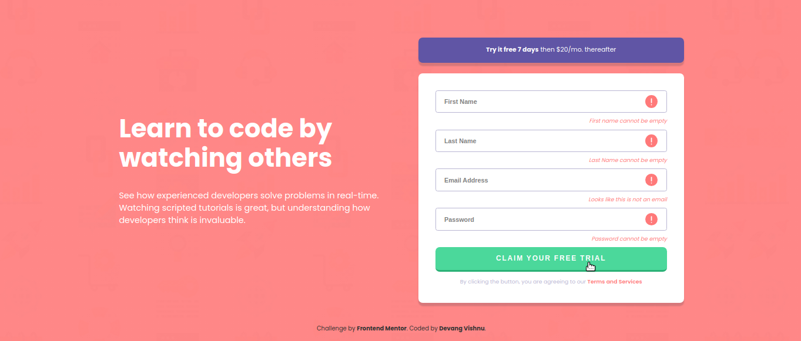
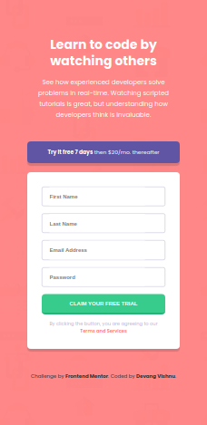
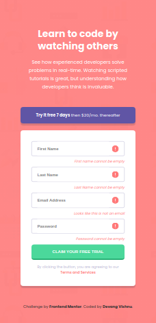

# Project-04 (P04) - Intro component with sign up form

## Table of Contents

- [Overview](#overview)
  - [Screenshot](#screenshot)
  - [Links](#links)
- [My process](#my-process)
  - [Tools used](#tools-used)
  - [Challenges faced](#challenges-faced)
  - [Lessons learned](#lessons-learned)
- [Author](#author)

## Overview

This is my fourth practice project from Frontend Mentor in this series.

### Screenshot

Down below I've added the screenshot of my project final results. The first one is for the desktop view and the second one is for the mobile view.

Desktop View - Contains screenshots for normal view and active view.

Mobile view - Contains screenshots for normal view and active view.

## My process

### Tools used

Following are the tools/languages that were used to build this project.

- Semantic HTML5
- CSS3
- Custom css variables
- Media queries for responsiveness
- Flexbox for layout
- JS
- DOM manipulation

### Challenges faced

I faced one major challenge while creating this project.

- Related to writing the conditional check logic for all input fields, especially email input:
  In this project, I firstly struggled to write conditional check for all inputs. The main challenge was to write the condition that would check for correct and valid emails. I learned a bit about how Regular Expression could be used for such cases.

### Lessons learned

This was a good project. It demanded decent DOM manipulation which led me to practice my JS knowledge. Writing logic for this project taught me some good lessons.

It took decent amount of CSS to style, though felt fairly easy. Had fun strengthening my flexbox concepts.

## Author

- My GitHub - [Devang Vishnu](https://github.com/thedevangvishnu)
- Frontend Mentor - [@thedevangvishnu](https://www.frontendmentor.io/profile/thedevangvishnu)
